# Оценка 3
# 1

# 2

git log выводит хеш коммита, возможно, указатель на последний коммит, автора коммита и дату его создания
# 3
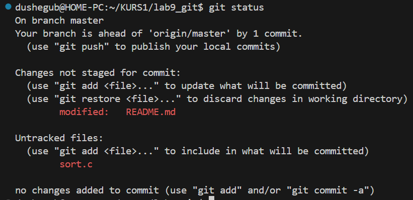

файл README.md был подифицирован, но не готов к коммиту, а файл sort.c неотслеживается
# 4

# 5

# 6

# 7

# 8
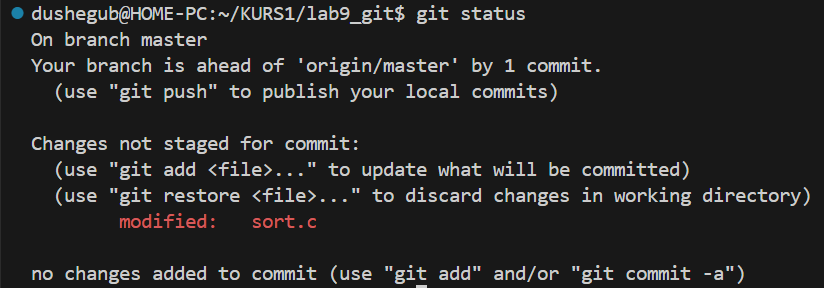

Изменил файл sort.c
# 9

Добавил sort.c в staged и закоммитил эти изменения
# 10
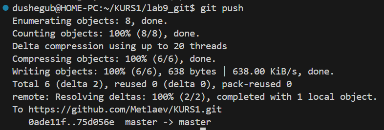
# 11

Создал ветку my_branch
# 12
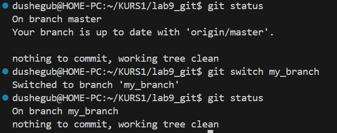

Сначала мы находимся в ветке мастер, она такая же, как и удалённая эта же ветка. Далее переходим в ветку my_branch, она аналогична master.
# 13
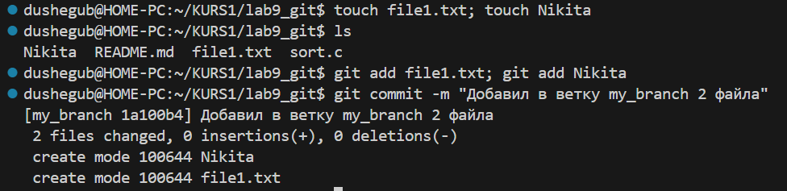

Добавил 2 файла в удалённый репозиторий и сделал коммит, говорящий об этом.
# 14
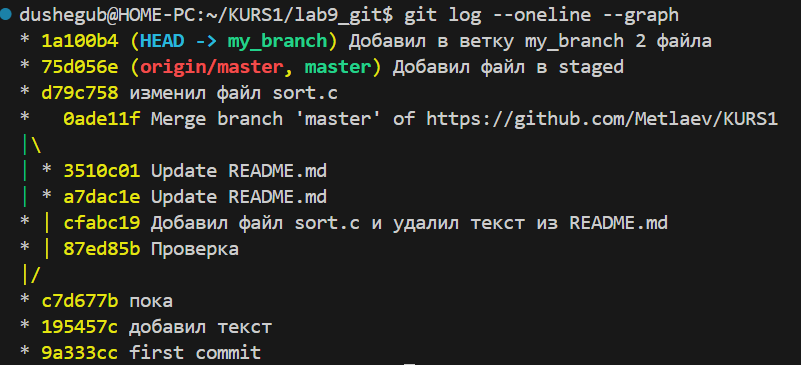

Теперь на этот коммит ветки my_branch указывает HEAD, но он ещё не на удалённом репозитории
# 15
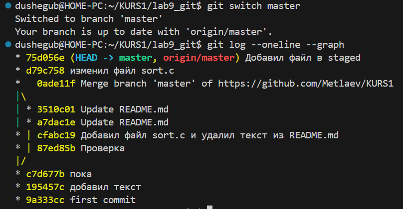

Теперь HEAD указывает на последний коммит в ветке master, который выгружен на удалённый репозиторий.
# 16
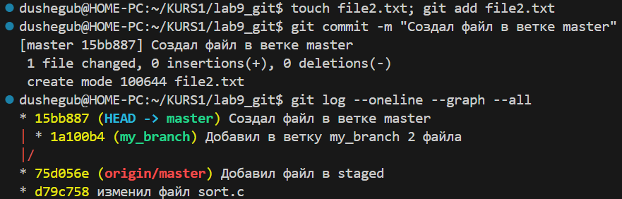

Добавил 2 файла в ветку master и закоммитил их. На этот раз видно, что у нас появилась вторая ветка с другим коммитом
# 17

Переключился на другую ветку, и теперь я не вижу file2.txt.
# 18

Посмотрел разницу между 2 ветками, например, в одной ветке есть file1.txt, а в другой его нет.

# Оценка 4
# 1

Показано знаком '-', что я удалил в файле, а знаком '+' что добавил.
# 2

Ничего не выводится, так как с флагом --staged git diff показывает разницу между файлом, находящимся в stage и последним коммитом
# 3
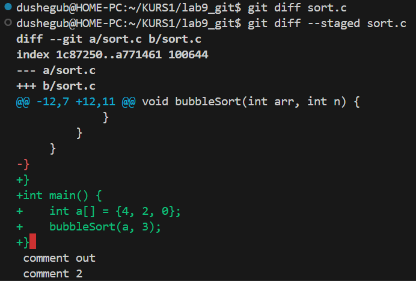

Команда git diff сравнивает файл в рабочей директории с файлом, готовым к индексации изменений, она ничего не выводит, так как файлы одинаковы, а вот git diff --staged показывает, что файл, находящийся в staged area, имеет отличия по сравнению с последним коммитом в локальном репозитории (т.е. из этой команды можно узнать, как будет выглядеть коммит).
# 4
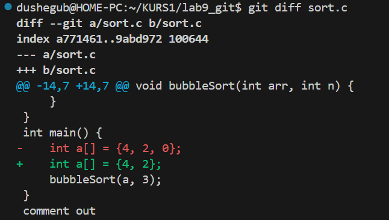 

Убрал из массива в файле sort.c 1 число, теперь git diff указывает на различия в файлах из рабочей директории и из индекса.

git add ещё не был использован, так что изменения всё те же, что и раньше при использовании этой команды

# 5

В выводе файл sort.c присутствует 2 раза, так как у нас этот файл одновременно находится и в индиксе, и в модифицированном виде
# 6

файл был перенесён из индекса (Staged area) в изменённое состояние, изменения остались в рабочей директории, и файл теперь снова можно править, а не сразу коммитить
# 7
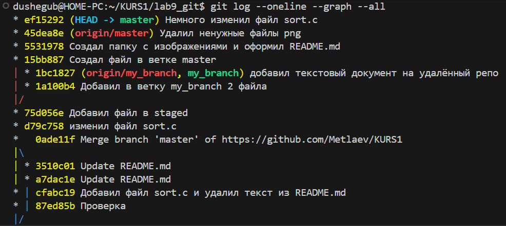

После индексации изменений и создания нового коммита, указатель HEAD теперь "смотрит" на него, но его ещё нет на удалённом репозитории
# 8

Добавил в файл sort.c printf("hello git\n");
# 9

Сейчас файл sort.c ещё не проиндексирован
# 10

После выполнения команды git restore sort.c, в файле удалились изменения из рабочего каталога, а сам файл вернулся к состоянию последнего git add.
# 11

Файла sort.c больше нет в состоянии modified, он находится в состоянии после коммита, но до изменений
# 12

Перед этим я создал пару файлов, сделал об этом коммиты, потом сделал новую ветку feature/uppercase и переключился на неё, в ней ещё нет файлов готовых для коммита
# 13

В данный момент я нахожусь в ветке feature/uppercase
# 14

Сейчас HEAD указывает на feature/uppercase, это значит, что последний коммит был сделан в этой ветке
# 15

В главной ветке регист букв не менялся
# 16
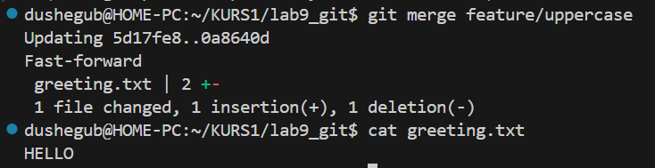

Смерджил ветку feature/uppercase в master, применилось слияние fast-forward, так как после создания новой ветки в основной больше не делались коммиты. Теперь при использовании команды cat выводится содержимое файла из новой ветки
# 17

После того, как я удалил ветку feature/uppercase, я слил ветку my_branch с master, был создан новый коммит слияния, чтобы связать 2 ветки, указатель как раз находися на нём

# Оценка 5
# 1
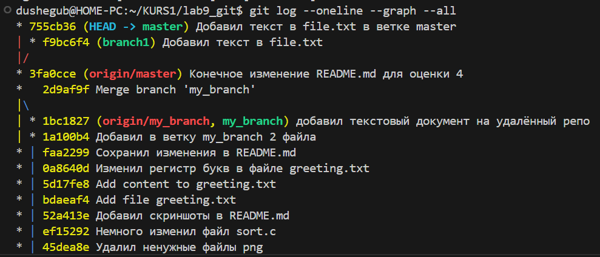

Создал ветку branch1, в ней добавил текст в file.txt, закоммитил изменения, дальше перешёл на главную ветку и вставил уже другой текст в file.txt, закоммитил и в итоге указатель HEAD указывает на последний коммит в ветке master 
# 2
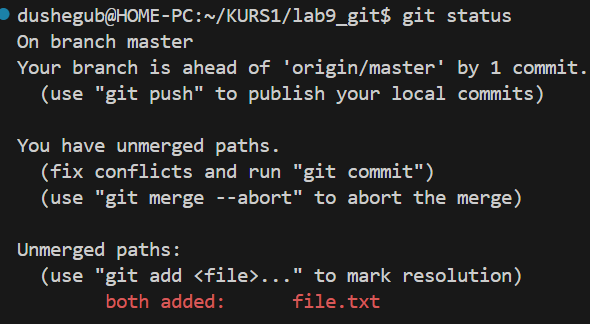

После мерджа возник конфликт, говорящий о том, что у нас в 2 ветках в одном и том же файле изменена одна строка, он предлагает мне исправить конфликт и закоммитить изменения
# 3

Сохранил текущие изменения в файле, то есть решил конфлик, теперь видно, что произошло fast-forward слияние
# 4
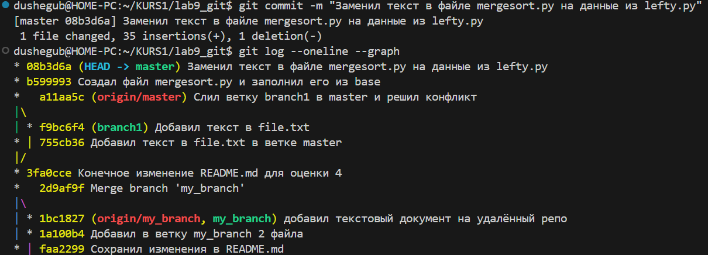

# 5

# 6

